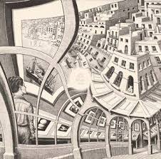

## Primer

This project aims to perform a Droste and Escher print complex function transforms onto a constructable self-similar scaled image, to provide a result similar to the style of art created by Maurits Cornelis Escher. This follows directly from methods established in the following [paper](https://pub.math.leidenuniv.nl/~smitbde/papers/2003-de_smit-lenstra-escher.pdf) and produces results similar to:

